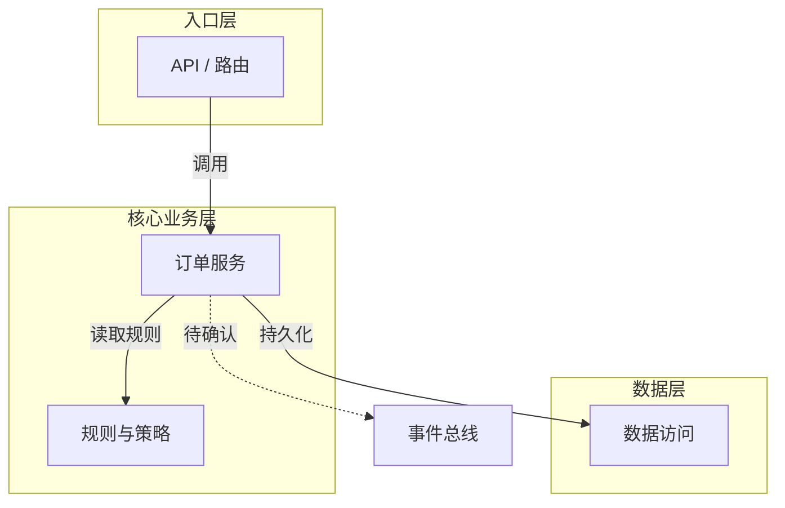
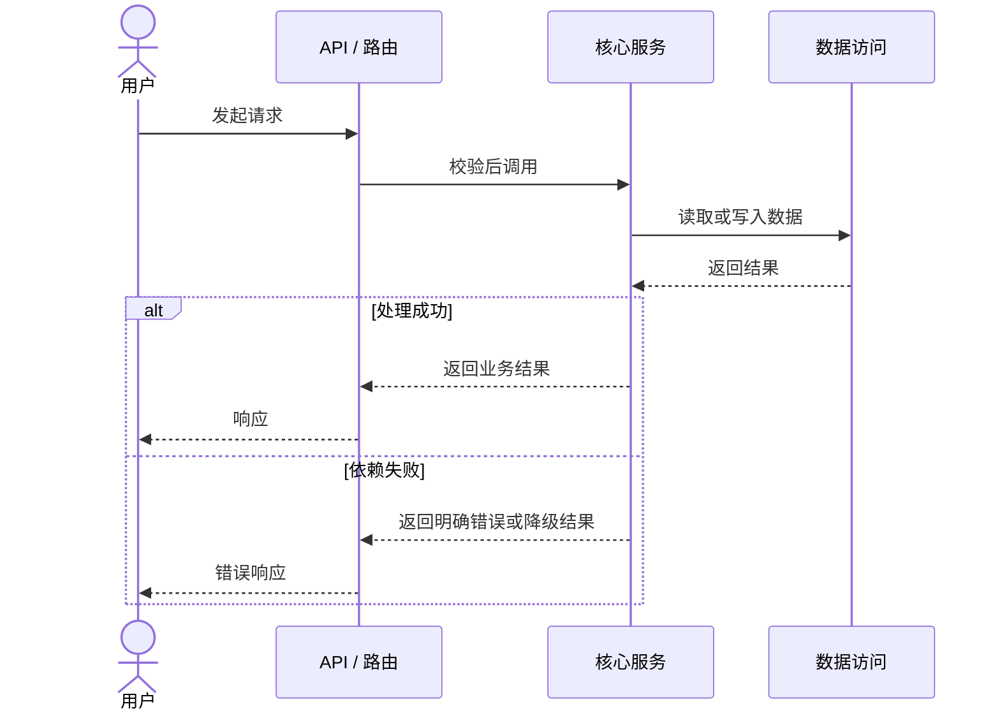

# 学习路径生成器

基于代码分析、业务链路、简历声明和拷打漏洞生成三层递进式学习路径：先建立系统全景图，再按“模块重要度 + 声明风险”深入，最后练习跨模块追问。

## 输入

- manifest 的 `current_artifacts.project_analysis`
- manifest 的 `current_artifacts.business_chains`
- manifest 的 `current_artifacts.resume`（如存在）
- `claim-grill-report.md`（如存在）
- `evidence-manifest.json`

## 设计理念

旧版学习路径的问题是：所有模块平铺列出，用户看不到模块之间的关系，不知道哪些是核心、哪些是支撑，读完每个模块还是串不起来。

新版用三层递进解决这个问题：

1. **第一层（全景图）**：先让用户看到整个系统的"地图"——模块之间的依赖关系、一条请求怎么走完全程。建立心智模型。
2. **第二层（模块详解）**：按重要度和声明风险分层，核心或高风险模块完整展开，支撑模块精简呈现。
3. **第三层（面试衔接）**：在单模块追问基础上，新增跨模块关系题——这些才是面试官真正会深挖的方向。
4. **缺口闭环**：每个 `RED/ORANGE/YELLOW` 都必须映射到学习任务和可验证达标标准。

---

## 输出格式

### 第一层：系统全景图

```markdown
# {项目名称} 学习路径

> ⏱️ 预计学习时间：{核心模块数 × 30 分钟 + 支撑模块数 × 10 分钟} 分钟
> 🎯 建议策略：先花 10 分钟看完「系统全景图」，再用 70% 时间啃 2-3 个核心模块，支撑模块快速浏览即可。

---

## 🗺️ 系统全景图

### 一句话定位

{项目名} 是一个 {一句话说清它是什么}，核心解决 {业务痛点}。基于 {技术栈} 构建，代码规模约 {文件数} 个源文件。

### 架构一览

使用 Mermaid `flowchart` 展示模块依赖。箭头方向统一为调用方到被调用方；节点 ID 使用稳定 ASCII 标识，中文模块名只放在方括号标签中。相同层级放入 `subgraph`，最多 4 层、每层最多 5 个模块。



**架构风格**：{如：分层架构 + 功能注册表模式 / 微内核 + 插件 / 事件驱动 / MVC}

**图后讲解**：用 3-5 句解释入口、核心边界、数据边界和横切能力。每句话至少对应图中的一个节点或一条边；虚线边必须说明缺少哪项证据。

### 角色表

把每个模块当作系统里的一个"角色"来介绍——它负责什么、跟谁打交道、有多重要。这张表读完就应该能回答「改 X 功能应该改哪个模块」。

| 层级 | 模块 | 一句话职责 | 依赖 | 被谁依赖 | 重要度 |
|------|------|-----------|------|---------|--------|
| 入口 | {模块名} | {职责（≤20 字）} | — | {依赖它的模块} | ⭐⭐⭐ |
| 核心 | {模块名} | {职责（≤20 字）} | {它依赖的模块} | {依赖它的模块} | ⭐⭐⭐ |
| ... | ... | ... | ... | ... | ... |

**重要度标准**：
- ⭐⭐⭐ 核心：理解系统必须搞懂的模块，缺了它整个系统不工作，面试高频考点
- ⭐⭐ 重要：独立子系统或关键横切层，面试偶尔涉及
- ⭐ 支撑：辅助工具/配置/胶水代码，知道存在即可，面试几乎不单独问

### 核心链路：一条请求走到底

选一条最有代表性的用户操作（优先选 STAR 简历中提到的核心功能），先用 Mermaid `sequenceDiagram` 展示时序，再用编号文字逐步讲解。参与者必须是代码或当前业务链路中已确认的模块；同步调用使用 `->>`，返回使用 `-->>`，可选/失败分支使用 `alt/else`。



```text
用户操作：{一句话描述}
1. `{模块名}` 收到请求：输入是什么，完成什么校验。
2. `{模块名}` 调用下游：传递什么数据，做出什么关键决策。
3. `{模块名}` 处理成功或失败：状态如何变化，错误如何返回。
4. 结果返回用户：最终消费者看到什么。
```

流程中每个模块名用反引号包裹，方便跳转阅读。图和文字必须使用同一组参与者与调用顺序；若时序方向无法确认，不把该调用画进图，只在文字中标 `[待确认]`。

### 你应该优先看哪些

基于模块重要度、简历声明风险、面试概率和掌握缺口，给出明确的阅读策略：

```
🔥 必读（2-3 个核心模块，理解系统骨架）：
  - {模块名}：{为什么必读（≤20 字）}
  - {模块名}：{为什么必读（≤20 字）}

📖 选读（了解关键横切/支撑逻辑）：
  - {模块名}：{什么时候需要看（≤20 字）}

📎 速览（知道存在即可）：
  - {模块名}、{模块名}、{模块名}

⚠️ 声明补漏（已经写入简历但尚未答稳）：
  - {CLAIM-ID}：{薄弱点} → {达标标准}
```

---

### 第二层：模块详解

核心模块（⭐⭐⭐）和重要模块（⭐⭐）使用**完整模板**，支撑模块（⭐）使用**精简模板**。

#### 完整模板（⭐⭐⭐ 核心 / ⭐⭐ 重要）

```markdown
---

## {序号}. {模块名} {重要度星级}

> 📎 依赖：{模块列表或用"—"} ｜ 被依赖：{模块列表}

### 为什么需要这个模块

{一句话：如果没有这个模块系统会怎样，或它承担什么不可替代的边界。不要复读功能列表。}

### 环节契约

| 项目 | 内容 |
|---|---|
| 输入 | {请求、事件、参数或上游状态} |
| 输出 | {返回值、事件、持久化状态或副作用} |
| 上游 | {谁调用它，触发条件是什么} |
| 下游 | {它调用谁，传递什么} |
| 失败边界 | {可预见失败、当前处理方式、未覆盖风险} |

每一项都要绑定代码、配置、测试或当前分析证据。未知项写 `[待确认]`，不得用常见框架行为补齐。

### 关键文件

{列出 3-6 个关键文件，每个一行说明职责。按重要性排序。用文件树片段展示它们在目录中的位置：}

```
src/core/
├── pipeline/
│   ├── orchestrator.ts   ← {一句话职责}
│   ├── scheduler.ts      ← {一句话职责}
│   └── stage.ts          ← {一句话职责}
└── ...
```

### 核心逻辑：{选一段 5-10 行的关键代码}

左侧放代码（从项目中直接摘取，不改动），右侧写逐行白话解释。格式：

```
┌─ 代码 ────────────────────────────┬─ 白话解释 ────────────────────────┐
│                                   │                                   │
│  async schedule(tasks: Task[]) {  │  接收一批待执行的任务              │
│    const groups = this.groupBy(   │  按资源类型把任务分组              │
│      tasks, t => t.resourceType   │  （比如 WPS 实例 vs Bridge）       │
│    );                             │                                   │
│    for (const group of groups) {  │  逐组处理                          │
│      await this.limitConcurrency( │  控制每组最多同时跑 N 个任务       │
│        group, this.maxParallel    │  （防止资源耗尽）                  │
│      );                           │                                   │
│    }                              │                                   │
│  }                                │                                   │
│                                   │                                   │
└───────────────────────────────────┴───────────────────────────────────┘
```

**要点**：这段代码说明了 {一句话概括这段代码展示了什么设计思想}。

### 💡 一个值得在面试中展开的设计决策

挑一个这个模块中最能体现工程能力的决策，用「问题 → 可选方案 → 为什么选这个 → 代价是什么」的四段式写清楚。这是面试时最有说服力的内容——比「我负责了 XX 模块」分量重得多。

```
{决策描述（≤60 字）}

为什么这样做：{1-2 句}

备选方案：{曾考虑过什么其他做法}

代价/边界：{这个决策有什么局限性，什么场景下可能不适用}
```

### 🎤 面试可能追问

{2-3 个具体问题，每个映射到代码位置。问题要能一句话答上来方向，但深挖时有料可讲。}

1. **{问题}** → 参考 `{文件路径}:{行号附近}`
2. **{问题}** → 参考 `{文件路径}:{行号附近}`

### ✅ 达标标准

- 能脱离文档画出本模块所在链路；
- 能指出关键文件和核心数据结构；
- 能解释一个替代方案和一个失败场景；
- 能在 {30 秒/2 分钟} 内回答关联的 `{CLAIM-ID}`。
```

#### 精简模板（⭐ 支撑）

```markdown
---

## {序号}. {模块名} ⭐

> 📎 依赖：{模块列表} ｜ 被依赖：{模块列表}

### 一句话职责

{一句话说清这个模块做什么、为什么需要它存在（≤40 字）}

### 环节契约

- 输入：{输入或 `[待确认]`}
- 输出：{输出或 `[待确认]`}
- 上游 / 下游：{模块关系}
- 失败边界：{一个真实失败点或 `[待确认]`}

### 关键文件

- `{文件路径}` — {一句话说明}
- `{文件路径}` — {一句话说明}

### 🎤 面试可能问

1. **{1 个问题}** → 参考 `{文件路径}`
```

---

### 第三层：跨模块面试题

面试官在问完单个模块后，通常会跳到「系统视角」的问题——这些题考察的不是你对某个文件的记忆，而是你对整个系统设计逻辑的理解。这一层的问题直接关联 STAR 简历中的架构决策层 Action。

```markdown
---

## 🎤 跨模块面试追问

以下问题考察你对系统整体设计的理解，答案会跨越多个模块。这些问题在面试后半段出现概率极高。

### 数据流追踪

> 「从 {用户操作} 到 {最终结果}，数据经过哪些模块？每个模块做了什么转换？」

**答题线索**：{2-3 句话给出答题方向，标注涉及的模块名}

### 架构权衡

> 「为什么把 {模块A} 和 {模块B} 拆成两个模块而不是合并？合并会有什么问题？」

**答题线索**：{2-3 句话给出答题方向}

### 故障隔离

> 「如果 {某个模块} 挂了，系统会怎样？你做了什么来防止级联故障？」

**答题线索**：{2-3 句话给出答题方向，如果不适用（比如单体小工具），可以换成其他跨模块问题}

### {额外 1-2 个针对该项目具体架构的跨模块问题}

根据项目实际架构特点生成。例如：
- 插件/注册表模式：「新增一个功能需要改几个模块？为什么这样设计注册流程？」
- 事件驱动：「事件总线和直接调用各用在什么场景？怎么决定用哪个？」
- 多进程/多线程：「跨进程通信为什么选 {方案} 而不是 {方案}？」
```

---

## 模块排序规则

模块在第二层中的出现顺序：

先计算：

```text
learning_priority = claim_risk(0-3) + interview_frequency(0-3) + mastery_gap(0-3) + architecture_importance(0-3)
```

1. 关联 `RED/ORANGE` 声明的模块优先；
2. 其次按全景图层级：入口层 → 核心业务层 → 横切层 → 数据/存储层 → 配置/部署层；
3. 同风险按重要度：⭐⭐⭐ 在前，⭐⭐ 次之，⭐ 最后；
4. 同重要度按被依赖数量排序。

不要把排序规则作为独立章节输出给用户——直接按这个顺序排好模块即可。

---

## 生成规则

### 第一层生成规则

**Mermaid 架构图**：
- 从代码分析结果中提取模块依赖关系，按调用方向组织层级
- 必须使用 `flowchart TD` 或 `flowchart LR`，不得用 ASCII 图代替
- 最多 4 层，每层最多列出 5 个模块名；项目不足 5 个模块时简化为两层
- 节点 ID 仅用 ASCII 字母、数字和下划线；显示名称放在 `[]` 中
- 实线表示已确认调用，虚线 `-.->|待确认|` 只表示存在依据但方向或运行时关系尚未证实
- 连边没有代码、测试或当前分析依据时删除，不为了视觉完整补线

**Mermaid 核心链路图**：
- 必须使用 `sequenceDiagram`，参与者与后续编号讲解一致
- 只画 4-8 个关键参与者和 5-12 条消息，避免把每个函数调用都画进去
- 至少表现一个正常返回；代码存在错误、重试或降级时使用 `alt/else` 表现，代码没有则不编造

**角色表**：
- 每个模块必须填满 6 列
- "一句话职责"必须少于 20 个汉字
- "依赖"和"被依赖"必须填写模块名（不用文件路径），没有就写 "—"
- 重要度标注要敢于判断——不要所有模块都是 ⭐⭐⭐，通常核心模块占 20-30%

**一条请求走到底**：
- 选 STAR 简历 Action 中最核心的那条用户操作来追踪
- 流程中标注出"哪个模块做了哪个关键决策"
- 路线控制在 5-10 步

### 第二层生成规则

**完整 vs 精简的判断**：
- ⭐⭐⭐ 核心模块：必须用完整模板，代码↔白话对照段落不可省略
- ⭐⭐ 重要模块：用完整模板，代码对照段可选（有值得讲的关键逻辑就放）
- ⭐ 支撑模块：用精简模板

**代码↔白话对照**：
- 从项目源码中直接摘取 5-10 行的关键逻辑片段
- 不要修改源码（保持原样，方便用户在 IDE 中对照）
- 选最能体现模块设计思想的片段——通常是核心算法、调度逻辑、关键数据结构操作
- 白话解释逐行写，用短句，不要说"这一行做了 X"——直接说做了什么
- 如果项目是脚本型/配置型语言（如 YAML、JSON 配置），可以换成"配置项拆解"（左侧配置，右侧解释每个字段的作用）

**设计决策段（💡）**：
- 每个核心模块只挑一个决策展开——多了就没有重点了
- 四段式（问题→方案→理由→代价）缺一不可
- 如果某模块确实没有值得展开的决策（比如纯胶水代码），可以省略此段

**面试追问方向**：
- 完整模板给 2-3 个问题，精简模板给 1 个
- 每个问题必须具体到「面试官会怎么措辞」，不能泛泛而谈
- 标注的文件路径必须真实存在于项目中
- 每个高风险 Claim 至少生成一个直接关联的问题和达标标准

### 第三层生成规则

- 数据流追踪题：选最核心的那条链路（和第一层「一条请求走到底」的路线一致）
- 架构权衡题：从 STAR 简历的架构决策层 Action 中提取
- 故障隔离题：从项目代码中实际的错误处理、重试、熔断等机制中提取；如果项目没有明显的容错机制，换成"如果要加容错你会怎么做"
- 额外问题数 = 1-2 个，从项目特有的架构模式中生成

---

## 质量要求

- 整份学习路径的总字数控制在 2500-5000 字（项目越大越接近上限）；Mermaid 源码不计入字数
- 文件路径和数据流描述必须与 `current_artifacts.project_analysis` 指向的当前项目分析一致
- 代码片段直接从源码复制，不要重写或简化
- 重要度标注要敢于取舍——如果所有模块都是 ⭐⭐⭐，等于没有标注
- 面试题的具体程度要能让用户直接拿来练习，不需要再自己翻译
- 所有技术术语保持与项目代码一致（不要自造缩写或换说法）
- `RED/ORANGE/YELLOW` 薄弱点必须全部映射到任务，不能只列“建议复习”
- `UNDERSTAND_ONLY` 模式不依赖 resume，直接根据业务链路生成路径

## 与交互式学习模板的衔接

本文件产出的当前学习路径是生成 `learning-interactive.html` 的**唯一内容来源**。写入后更新 `current_artifacts.learning_path`；HTML 生成从该映射读取，不重新分析代码，只做格式转换。以下内容块直接映射到 HTML 元素：

| 当前学习路径内容 | HTML 元素 |
|------------------------|-----------|
| 一句话定位 | `module-0` 的 `.module-subtitle` |
| Mermaid 架构图 | `module-0` 的第一个 `.mermaid-panel` |
| Mermaid 核心链路图 | `module-0` 的第二个 `.mermaid-panel` |
| 角色表（表格） | `.role-cards` 网格，每行一张 `.role-card` |
| 一条请求走到底（有序列表） | `.flow-steps` 横向步骤动画 |
| 模块的「为什么需要这个模块」 | 对应模块的「为什么需要这个模块」`<p>` |
| 模块的环节契约 | `.contract-grid`，展示输入、输出、上下游和失败边界 |
| 模块的关键文件（文件树片段） | `.file-tree`，每文件一个 `.ft-item` |
| 核心逻辑（代码对照） | `.translation-block` 左右对照 |
| 设计决策（四段式） | `.decision-card` |
| 模块的面试追问 | 衍生为 `.quiz-container` 测验（仅核心模块） |

生成 markdown 时，确保以上内容块完整、结构清晰，以便 Step 2.5 直接提取转换为 HTML。代码块用 ` ``` ` 围栏标记，方便识别。

## 失败模式

| 触发条件 | 一线修复 | 仍失败则 |
|---|---|---|
| 没有简历 | 使用业务链路和目标岗位排序 | 标记为理解模式 |
| 没有拷打报告 | 用 manifest 风险和掌握度排序 | 标记“待实战校准” |
| 文件路径失效 | 重新定位符号 | 移除路径并标 `[待确认]` |
| Mermaid 节点或连边无证据 | 删除无证据连边；部分证据用虚线标“待确认” | 同步输出文字链路并列出证据缺口 |
| Mermaid 语法校验失败 | 修正节点 ID、标签转义和图类型 | 保留可读源码并标记“待渲染修复”，不得输出空图 |
| 学习内容过多 | 只保留最高优先的 3 个模块 | 其余进入选读 |

## 不要做

- 不要所有模块都标为核心。
- 不要只按目录顺序生成学习路径。
- 不要给高风险声明配泛泛的八股知识。
- 不要重写源码片段。
- 不要用 ASCII 图代替 Mermaid，也不要只画图不写图后讲解。
- 不要从目录结构猜测调用边或时序消息。
- 不要省略输入、输出、上下游、失败边界和达标标准。
